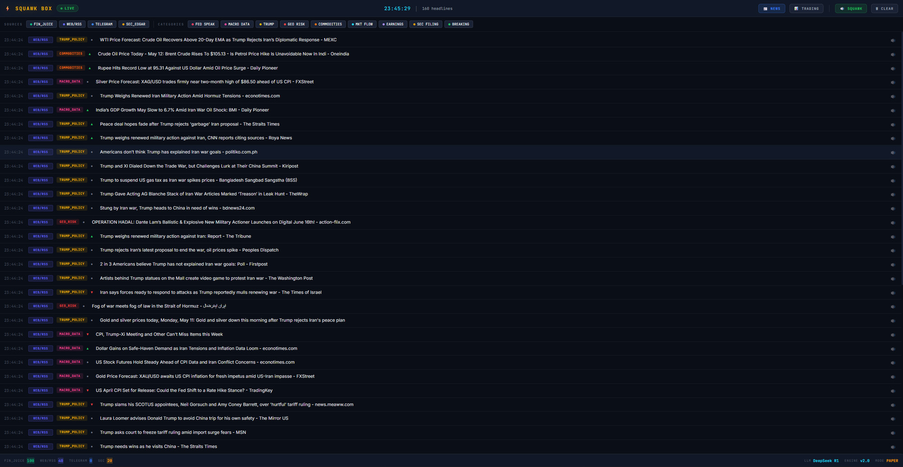
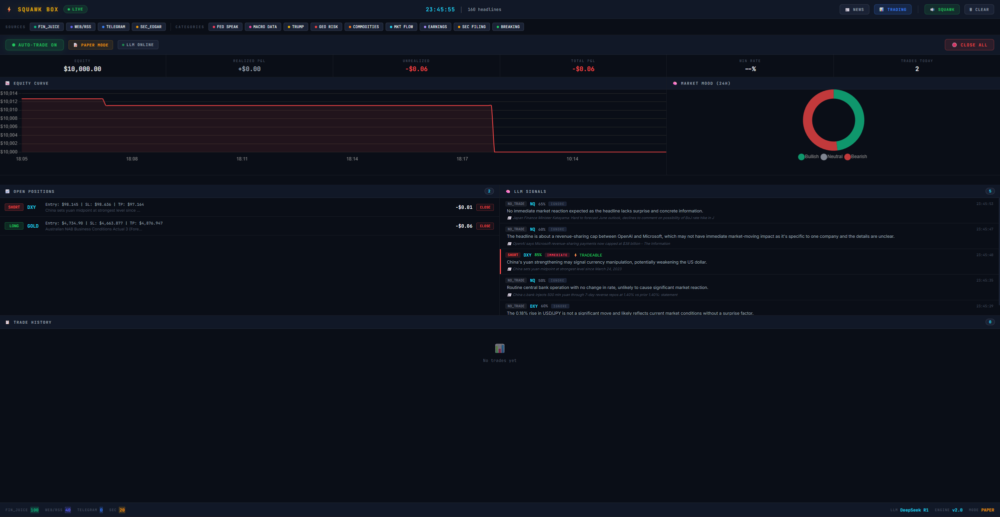

<div align="center">

# ⚡ Squawk Box

### Real-time financial news trading engine. Listens to the firehose, reasons with an LLM, pulls the trigger.



</div>

When Trump tweets a tariff, when Powell opens his mouth, when a missile hits a tanker in the Strait of Hormuz — futures move in the first 30 seconds. **Squawk Box** is built to be in the trade before the headline finishes loading on Bloomberg.

---

## 🔥 What It Does

A full-stack, end-to-end news trading pipeline running locally on your own machine:

1. **Ingests** breaking news from Telegram channels, Google News, Yahoo Finance, FinancialJuice, and SEC EDGAR — concurrently, in real time.
2. **Filters** the noise with a hand-tuned regex matrix that knows what actually moves ES, NQ, BTC, gold, and oil.
3. **Reasons** about each surviving headline with a locally-hosted **DeepSeek R1 14B** LLM (via Ollama) — extracting direction, instrument, confidence, urgency, and magnitude as structured JSON.
4. **Executes** trades automatically through a paper-trading simulator *or* live Binance Futures, with tight stops, trailing exits, position sizing tiers, and daily loss circuit breakers.
5. **Broadcasts** everything to a live web dashboard over WebSockets — with a text-to-speech squawk so you literally *hear* the news as it breaks.

---

## 📺 The Dashboard

<div align="center">

**Live trading view — LLM signals, open positions, equity curve, and market mood, all in one pane.**



**The news firehose — every headline tagged by source and category, in real time.**


</div>

---

## ⚡ Why This Is Different

Most "news trading" repos stop at sentiment scoring on Twitter. This one is the whole stack:

- **Source-aware filtering** — FinancialJuice headlines (pre-curated by pros) get a fast lane; raw RSS runs the strict regex gauntlet.
- **Structured LLM signals** — no vibes-based sentiment. Every signal is a typed `LLMSignal` with `direction`, `confidence`, `urgency`, `magnitude`, and reasoning. R1's `<think>` chain-of-thought is stripped before parsing.
- **Two-tier urgency** — critical headlines (Fed, Trump, geopolitics) jump the queue; everything else gets batched.
- **Real risk management** — per-instrument cooldowns, conflicting-signal suppression, trailing stops, max-duration auto-close, daily loss caps. Not a toy.
- **Local-first** — your model, your data, your machine. No OpenAI key, no subscription.

---

## 🧠 The Stack

| Layer | Tech |
|---|---|
| News ingestion | `aiohttp`, `feedparser`, `telethon` (Telegram MTProto) |
| Filtering | Tiered regex matrix in `filters.py` (Fed Speak, Macro Data, Trump Policy, Geo Risk, Commodities, Flow) |
| Reasoning | Local **DeepSeek R1 14B** via **Ollama** |
| Backend | `FastAPI` + WebSockets |
| Persistence | `aiosqlite` |
| Execution | Paper executor *or* live **Binance Futures** via `ccxt` |
| Audio | `edge-tts` for text-to-speech squawk |
| Terminal UI | `rich` Live dashboard |
| Web UI | Vanilla JS + WebSocket stream |

---

## 🚀 Quick Start

```bash
# 1. Clone
git clone https://github.com/Kiankk/squawk-box.git
cd squawk-box

# 2. Install
pip install -r requirements.txt

# 3. Pull the model
ollama pull deepseek-r1:14b

# 4. Configure credentials (.env)
cp .env.example .env   # then edit
#   TG_API_ID=...
#   TG_API_HASH=...
#   OLLAMA_URL=http://localhost:11434
#   EXECUTOR=paper            # or "binance"

# 5. Run the full stack
uvicorn server:app --reload
# open http://localhost:8000

# Or run the terminal-only squawk box
python main.py
```

---

## 🎛️ Configuration Highlights

Everything tunable lives in `trading_config.py`:

```python
MIN_CONFIDENCE      = 0.75   # LLM confidence floor
HIGH_CONFIDENCE     = 0.85   # bump to medium size
ULTRA_CONFIDENCE    = 0.93   # max size
MAX_OPEN_POSITIONS  = 3
MAX_DAILY_LOSS_USD  = 500
DEFAULT_STOP_LOSS_PCT      = 0.5    # tight scalp stops
DEFAULT_TAKE_PROFIT_RATIO  = 2.0    # 1:2 R:R
ENABLE_TRAILING_STOP       = True
```

Position sizing scales with model confidence — small, medium, or large.

---

## 📊 What You See

- A live web dashboard showing every headline as it lands, color-coded by category.
- LLM verdicts streamed in: `SHORT DXY · conf 0.85 · IMMEDIATE · TRADEABLE — "China sets yuan midpoint at strongest level since 2023"`.
- Open positions with live P&L, trailing stops, time-to-auto-close.
- Equity curve, win rate, daily trade count, and market mood — all on one screen.

---

## ⚠️ Disclaimer

This is a research project. News trading is brutal, the LLM can be wrong, and live execution against Binance Futures **will lose you real money** if you misconfigure it. Default mode is paper trading. Leave it there until you know exactly what every knob does. Not financial advice.

---

## 🗺️ Roadmap

- [ ] Twitter/X firehose integration
- [ ] Multi-model voting (R1 + Llama + Qwen ensemble)
- [ ] Backtesting harness against historical headline archives
- [ ] Discord/Telegram alert webhooks
- [ ] Browser extension for one-click headline injection

---

## 🤝 Contributing

Issues and PRs welcome. If you find a category of headline this misses, open an issue with the source and timestamp — the filter matrix gets sharper every iteration.

---

<div align="center">

⭐ **Star this repo** if you want to follow along — this is going to keep getting better.

</div>
